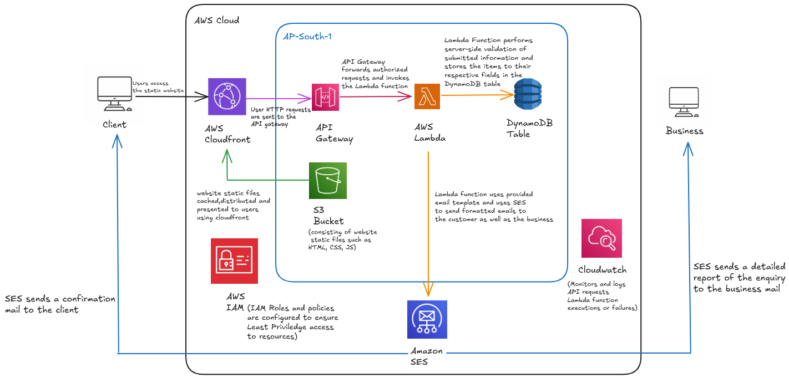

# TravelEase Contact Form

This repository contains a complete, serverless web application built on AWS and is designed to be a secure, scalable, and cost-effective solution for handling contact form submissions. It is intended to handle customer enquiries for businesses to ensure clear communication between both parties of any business transaction. It features a modern frontend, a robust serverless backend, and is fully defined using Infrastructure as Code. In this project, the contact form is a travel enquiry form for a travel agency which had 4 requirements:

- Send a well formatted confirmation message to the customer immediately after a successful enquiry.
- Send a detailed Email to the business mail containing all the important details of any enquiry submission.
- Have a common enquiry reference number for customer support (sent both to the customer as well as to the business).
- Server and Client side validation for form entries.

## Features

- **Modern Frontend:** A responsive and user-friendly contact form built with **Next.js**.
- **Serverless Backend:** No servers to manage. The backend logic is handled by an **AWS Lambda** function written in Python.
- **Durable Storage:** Form submissions are stored securely in **Amazon DynamoDB**, a highly scalable NoSQL database.
- **Email Notifications:** Uses **Amazon Simple Email Service (SES)** to send transactional confirmation emails to users and notification emails to the business.
- **Secure API:** A public API endpoint is created and managed by **Amazon API Gateway**, which proxies requests to the Lambda function.
- **Global Content Delivery:** The static Next.js website is hosted on **Amazon S3** and delivered globally with low latency via **Amazon CloudFront**.
- **Infrastructure as Code (IaC):** The entire AWS infrastructure is defined and managed using **HashiCorp Terraform**, allowing for repeatable and automated deployments.
- **Secure Configuration:** Sensitive data like email addresses are stored securely in **AWS Secrets Manager** and injected into the Lambda function at runtime.

---

## Architecture & Information Flow
**Architecture Diagram**



**Information Flow**

This application follows a decoupled, event-driven architecture. The flow of information is as follows:

1.  **User Accesses Website:** A user navigates to the public URL provided by Amazon CloudFront.
2.  **Content Delivery:** CloudFront serves the static Next.js website, with the files stored in an S3 bucket.
3.  **Form Submission:** The user fills out the contact form. The frontend JavaScript performs initial client-side validation.
4.  **API Call:** On submit, the browser sends a `POST` request containing the form data in JSON format to the Amazon API Gateway endpoint. The browser first performs a CORS preflight (`OPTIONS`) request, which API Gateway handles to ensure cross-origin security.
5.  **Lambda Invocation:** API Gateway receives the `POST` request and, via a proxy integration, triggers the Python Lambda function, passing the request body and headers.
6.  **Backend Processing:** The Lambda function executes the following logic:
   
    a.  **Re-validation:** It performs comprehensive server-side validation on the incoming data for security.
    
    b.  **Destination Check:** It makes an external API call to the OpenStreetMap Nominatim service to verify the user-provided destination is a real place.
    
    c.  **Data Persistence:** It generates a unique `submissionId` and timestamps, then stores the complete record in the Amazon DynamoDB table.
    
    d.  **Email Notifications:** It uses Amazon SES to send two emails: a confirmation to the customer and a detailed notification to the business.
    
    e.  **Response:** The function returns a structured JSON response with `statusCode: 200`, CORS headers, and a success message.
7.  **Success Confirmation:** API Gateway passes the Lambda's successful response back to the user's browser. The frontend JavaScript then displays a "Thank You" message.

---

## Prerequisites

Before you begin, ensure you have the following installed and configured:

-   **An AWS Account:** With administrative permissions to create the necessary resources.
-   **AWS CLI** configured with your credentials.
-   **Terraform CLI** 
-   **Node.js and npm** 
-   **Python and pip** 

---

## Installation and Deployment

Follow these steps to deploy the entire application from scratch.

### Step 0: Pre-Setup - AWS Secrets Manager & SES

This project requires you to store your "from" and "to" email addresses securely.

1.  **Create a Secret in AWS Secrets Manager:**
    -   Go to the AWS Secrets Manager console.
    -   Click **"Store a new secret"**.
    -   Select **"Other type of secret"**.
    -   In the "Key/value pairs" section, create three keys:
        -   `source_email`: The email address you will send from.
        -   `business_email`: The internal email address that will receive notifications.
        - `test_customer-email`: The email which will serve as customer email and recieve the enquiry confirmation (please note: This step is not required if you already have production access on your AWS SES service).
    -   Click **Next**.
    -   Name the secret `TravelEase/emails`.
    -   Complete the process by clicking **"Store"**.

2.  **Verify Emails in SES:**
    -   Go to the Amazon SES console.
    -   Click **"Verified identities"** and then **"Create identity"**.
    -   Verify **both** email addresses you stored in Secrets Manager. You will need to click a confirmation link sent to each inbox. This is required to send emails while in the SES Sandbox.
    - Please note: In this project, the email identities are created and managed using terraform and the resources are defined in the [ses.tf](Infrastruture/ses.tf) file, so every time we use `terraform destroy`, the email identities are also destroyed, hence requiring verification SES everytime `terraform apply` is used for resource creation.

### Step 1: Clone the git repo

1.  **Paste the following command in the terminal:**
    ```bash
    git clone git@github.com:Nilaj0914/TravelEase-Contact-Form.git
    ```
### Step 2: Export the Frontend static files

1.  **Navigate to the [Frontend](Frontend) directory and run:**
    ```bash
    npm install
    ```
    -   Doing this will install all the required next.js dependencies
2. **Export the static files**
    ```bash
    npm run build
    ```
    - Doing this will build and export all the frontend static files in an ```out``` folder
### Step 3: Deploy with Terraform

1.  **Navigate back to the root of the `Infrastruture` directory :**
    ```bash
    cd ../Infrastruture/
    ```
2.  **Initialize Terraform :**
    ```bash
    terraform init
    ```
3.  **Plan and apply the infrastructure :**
    ```bash
    terraform apply
    ```
4.  **Review the plan and type `yes` to confirm.**
5.  **After the deployment succeeds, Terraform will output the `api_gateway_invoke_url`. Copy this URL.**

### Step 4: Configure and Deploy the Frontend

1.  **Create an Environment File:**
    -   In the `Frontend` directory, create a new file named `.env.local`.
    -   Add the following line, pasting the URL you copied from the Terraform output. **Remember to add `/submit` at the end.**
    ```bash
    NEXT_PUBLIC_API_ENDPOINT="https://<your_api_id>.execute-api.<region>.amazonaws.com/prod/submit"
    ```

2.  **Deploy to S3:**
    -   Sync the contents of the generated `out/` folder with your S3 bucket.
    ```bash
    aws s3 sync out/ s3://travelease-nextjs-website
    ```

Your website is now live! You can test the form by navigating to your CloudFront URL.